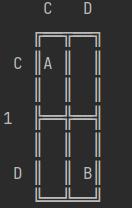

# RL-IPD-NCLAB

## Introduction

**RL-IPD-NCLAB** is a research project focusing on the application of Reinforcement Learning (RL) in the Iterated Prisoner's Dilemma (IPD) within a network computing laboratory environment. This project aims to explore the dynamics of cooperative and competitive behaviors in agent-based models, utilizing the principles of RL to adapt and evolve strategies over time.

## Project Structure

The project is organized into several key components:

- **Buffer**: Contains the implementation of the replay buffer used in reinforcement learning algorithms.
- **Evaluation**: Scripts and tools for evaluating the performance and strategy effectiveness of RL agents.
- **Agents**: The directory hosts various RL agent implementations that compete or cooperate in the IPD.
- **Envs**: Custom environments for the Iterated Prisoner's Dilemma, tailored for reinforcement learning experiments.
- **Results**-Currently contains percentage of each choice after running 200 episode experiments of all fixed agents againts all vanilla value based agents
- **main.py**: The main script to kick off training sessions or experiments.
- **run.py**: A utility script for executing specific models or tests within the project framework.

## Getting Started


### :warning: Work in Progress :warning:

This project is currently under development. The instructions below are preliminary and subject to change.
### The IPD env

The Iterated Prisoner's Dilemma (IPD) game's dynamics can be understood through its payoff matrix. The matrix represents the outcomes for Player 1 (rows) and Player 2 (columns) based on their decisions to either Cooperate (C) or Defect (D).



Explanation of the Payoff Matrix:

C-C (Top-Left Cell): Both players choose to cooperate, typically resulting in a reward for mutual cooperation (R,R).

C-D (Top-Right Cell): Player 1 cooperates while Player 2 defects, often leading to the sucker's payoff for Player 1 and the temptation payoff for Player 2 (S,T).

D-C (Bottom-Left Cell): Player 1 defects while Player 2 cooperates, resulting in a temptation payoff for Player 1 and the sucker's payoff for Player 2 (T,S).

D-D (Bottom-Right Cell): Both players choose to defect, usually resulting in a punishment for mutual defection, which is better than the sucker's payoff but worse than mutual cooperation (P,P).

The `GameConfig` class plays a crucial role in setting up the parameters for different game simulations within the RL-IPD-NCLAB project. This flexible configuration allows for easy adjustments and additions of game settings, enabling the exploration of various game theories and reinforcement learning strategies under different conditions.


### Example Usage:

```python

# Initialize game configurations with specific game payoff values
game_config = GameConfig(T=5, S=0, P=1, R=3)


# Add a new game configuration
game_config.add_game(
    game_name="new_game",
    rounds=15,
    payout_matrix=[[(3, 3), (0, 5)], [(5, 0), (1, 1)]],
    algorithm_type="MULTI AGENT",
    memory=4,     #length of observations recieved
    history_length=4,  #length of state vector
    obs_type="both"  # Can be 'self', 'other', or 'both'
)

# Retrieve configuration for an existing game
prisoners_dilemma_config = game_config.get_game_config("prisoners_dilemma")
if prisoners_dilemma_config:
    print(f"Rounds: {prisoners_dilemma_config['rounds']}")
    print(f"Payout Matrix: {prisoners_dilemma_config['payout_matrix']}")
    print(f"Algorithm Type: {prisoners_dilemma_config['algorithm_type']}")
    print(f"Memory: {prisoners_dilemma_config['memory']}")
    print(f"History Length: {prisoners_dilemma_config['history_length']}")
    print(f"Observation Type: {prisoners_dilemma_config['obs_type']}")

```
### Prerequisites

Before you begin, ensure you have met the following requirements:

- Python 3.x installed on your system.

### Installation

Clone the RL-IPD-NCLAB repository to your local machine:

```bash
git clone https://github.com/Anna4142/RL-IPD-NCLAB.git
cd RL-IPD-NCLAB
